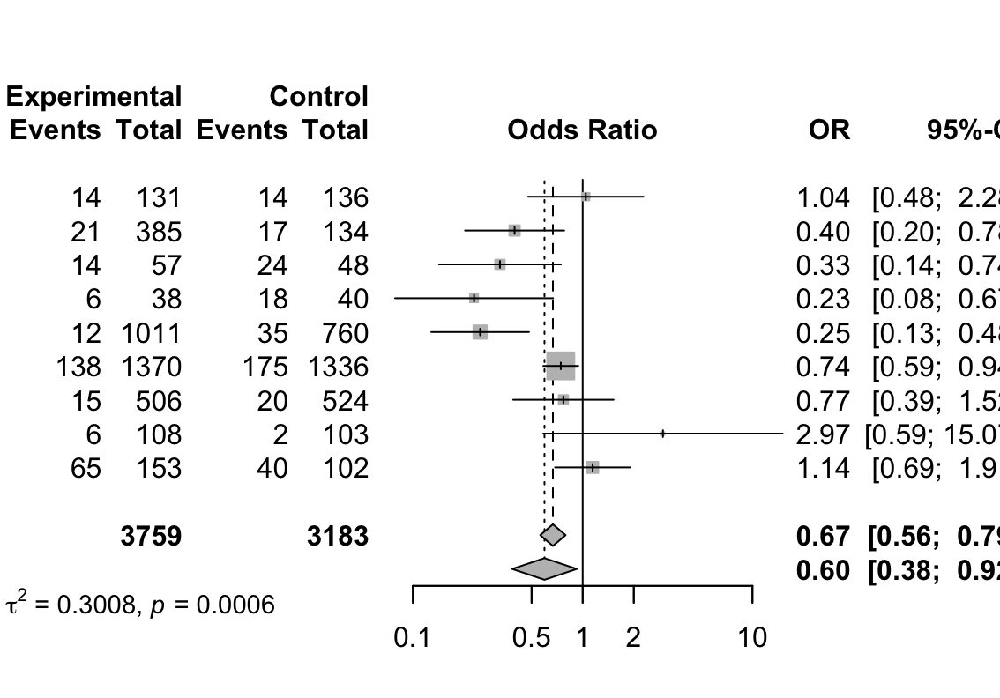

# meta-analysis-preeclampsia

#  Meta-Analysis of Preeclampsia Treatment Studies

This repository contains the code and dataset for a meta-analysis based on 9 published clinical trials (1962–1975), evaluating the effectiveness of a treatment in reducing the risk of preeclampsia.

##  Objective
- To estimate the pooled treatment effect using odds ratios (OR)
- To explore between-study heterogeneity
- To assess potential publication bias through graphical and statistical methods

## Methods

- **Data input**: Manually entered based on published trial results (n = 9 studies)
- **Effect measure**: Odds Ratio (OR)
- **Methodology**:
  - Mantel-Haenszel method (common effect model)
  - Random-effects model (due to heterogeneity: I² = 70.7%)
  - Forest plot for visual summary
  - QQ plot for normality of residuals
  - Funnel plot symmetry tested with:
    - Begg’s rank correlation
    - Peters’ regression test
    - Trim-and-fill method (1 imputed study)

## Results

- **Pooled OR (random effects)**: 0.60 [95% CI: 0.38 – 0.92], *p* = 0.0205  
- Interpretation: ~40% reduction in the odds of preeclampsia in the treatment group  
- **Heterogeneity**: I² = 70.7%, *p* = 0.0006 – substantial heterogeneity  
- **Publication bias**:  
  - Begg: *p* = 0.6767 (not significant)  
  - Peters: *p* = 0.5080 (not significant)  
  - Trim-and-fill: Adjusted OR = 0.66 [0.42–1.04], *p* = 0.0724

##  Visualization
- Forest plot and QQ plot generated using `meta` and `metafor` packages
This forest plot visualizes the individual study odds ratios and the combined estimate:

##  QQ Plot

Residual analysis to check normality of standardized effects:

## Interpretation
This meta-analysis provides statistically significant evidence supporting the treatment’s effectiveness in reducing preeclampsia risk. However, due to the high heterogeneity (I² > 70%), interpretation should be made using the random-effects model. No clear evidence of publication bias was found, though one potentially missing study was suggested by the trim-and-fill method.

## Reflection

This analysis allowed me to apply key meta-analysis concepts such as odds ratio estimation, heterogeneity assessment, and bias testing. I learned to choose appropriate models based on data variability and to interpret results cautiously when heterogeneity is high.

This small-scale project demonstrates the application of statistical methods to real-world clinical questions, and represents one of the first steps in building my portfolio in biostatistics.

##  R Packages Used
- `meta`
- `metafor`
- `metacom`

##  License
This project is released under the MIT License.

